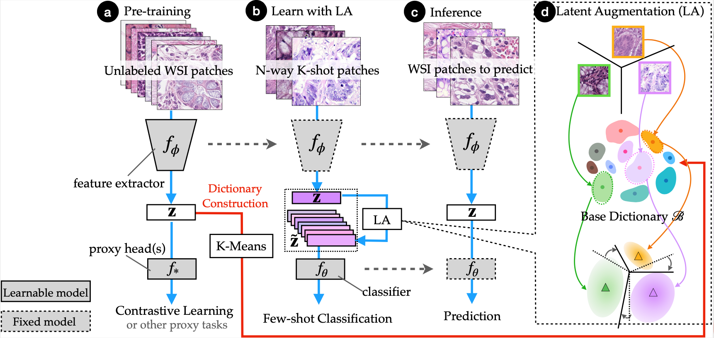

# Towards Better Understanding and Better Generalization of Low-shot Classification in Histology Images with Contrastive Learning.

This project hosts the code for the paper
> [**Towards Better Understanding and Better Generalization of Low-shot Classification in Histology Images with Contrastive Learning**](https://openreview.net/forum?id=kQ2SOflIOVC),  
> Jiawei Yang, Hanbo Chen, Jianpeng Yan, Xiaoyu Chen, and Jianhua Yao    
> International Conference on Learning Representations (ICLR), 2022
<!-- > *arXiv preprint ([arXiv number](tbd_link))*   -->

Please consider citing our paper in your publications if the project helps your research. BibTeX reference is as follow.
```
@inproceedings{
  yang2022towards,
  title={Towards Better Understanding and Better Generalization of Low-shot Classification in Histology Images with Contrastive Learning},
  author={Yang, Jiawei and Chen, Hanbo and Jianpeng, Yan and Xiaoyu, Chen and Jianhua, Yao},
  booktitle={International Conference on Learning Representations (ICLR)},
  year={2022}
}
```

<p align="center">
  
</p>

# Installation

We use [OpenSelfSup](https://github.com/open-mmlab/OpenSelfSup) for contrastive learning pre-training (CLP) and fully-supervised pre-training (FSP). You can refer to [INSTALL.md](openselfsup_docs/INSTALL.md) for repo installation and dataset preparation. 
In the paper, we use [NCT-CRC-HE-100K-NONORM](https://zenodo.org/record/1214456) as our pre-training dataset, where the sizes of all images are exactly 224×224. Therefore they can be easily handled by `ImageList` Dataloader.


# Dataset

We use three datasets:

- [NCT-CRC-HE-100K-NONORM](https://zenodo.org/record/1214456) as the pre-training dataset and for near-domain tasks.
- [LC-25000](https://academictorrents.com/details/7a638ed187a6180fd6e464b3666a6ea0499af4af)(LC25K) for mixture-domain tasks.
- [PAIP2019](https://paip2019.grand-challenge.org/)(PAIP) for out-domain tasks.
  
We provide the pre-computed features for them. See blow.

## Pre-trained models, Pre-computed features and pre-generated base dictionaries.

We provide the pre-trained models, pre-computed features and pre-generated base dictionaries in this [link](https://drive.google.com/drive/folders/1rWX06NeWzPUtcA_IPE-n0eDVcz47Hiq2?usp=sharing). To use them, download them and put them in `wsi_workdir/workdir`. Refer to Pre-Training session at the end of this document for more details of the training scripts.


# Usage

## 0. Extract features
We recommend to use the pre-computed features. However, we provide the full scripts for extracting features in `wsi_workdir/scripts` for different tasks, i.e., `extract_near_domain_feats.sh` and `extract_mixture_and_out_domain_feats.sh`.


## 1. Use extracted features to generate tasks

For computational efficiency, reproducibility and parallelization, we use the pre-trained models to extract features at first, and pre-generate meta-testing tasks to make results reproducible and to avoid duplicated encoder forwards for same images in different experiments. we choose to generate meta-testing tasks as seperate files.

```shell
    # near-domain (NCT dataset)
    python3 -u wsi_workdir/tools/generate_task.py \
        --task near \             # choose among [near,mixture,out].
        --initialization \        # whether to overwrite existing task files
        --num_shots ${num_shot} \ # number of shots, e.g., 1, 5, 10
        --num_task 1000 \         # number of tasks, e.g., 300, 1000
        --model ${model} \        # use features from which model, choose between [clp, fsp]
        --novel_class 7           # specify novel class, used only in near-domain tasks
```

Similarily for mixture-domain task and out-domain task (No need to specify novel class):

```shell
    # mixture-domain (LC-25000 dataset)
    python3 wsi_workdir/tools/generate_task.py \
        --task mixture \          # generating mixture-domain task.
        --num_shots ${num_shot} \    
        --num_task 1000 \
        --initialization \
        --model ${model}

    # out-domain (PAIP19 dataset)
    python3 wsi_workdir/tools/generate_task.py \
        --task out \           # generating out-domain task.
        --mode hetero \        # choose between [hetero,homo] to specify patch-selection mode
        --num_shots $num_shot \
        --num_task 1000 \
        --initialization \
        --model ${model}
```
The full-scripts are provided in `wsi_workdir/scripts/generate_xxx_tasks.sh`, `xxx` could be `near_domain`, `mixture_and_out_domain`, and `ablation`.

Note that, the generating time could vary drastically depending on the storage system, e.g., less than 1 minute for SSD, and hours for distributed ceph.

### 2. Construct base dictionary

For computational efficiency, we construct base bank and pre-generate the latent shift vectors for each cluster, i.e., \delta in our paper.

To do this, run
```shell
    python3 -u wsi_workdir/dict_construction.py \
        --model $model \      # use features from which model, choose between [clp, fsp]
        --novel_class $novel  # the excluded novel class in near-domain task
```
where the novel class is the excluded novel class in NCT dataset. Not passing novel_class parameter will generate base dictionary that is contructed on the entire training set of NCT dataset.

### 3. Meta-testing

For meta-testing in near-domain task, run
```shell
    # near-domain
    python3 -u wsi_workdir/distributed_meta_test.py \
        --task near \             # choose among [near,mixture,out,out_homo].
        --num_task 1000 \         # number of tasks, e.g., 300, 1000        
        --num_shots ${num_shot} \ # number of shots, e.g., 1, 5, 10
        --mode linear   \         # `linear` for baseline and `latent_aug` for LA
        --model ${_model} \       # choose between [clp,fsp] + _wo_X, e.g., clp_wo_7
        --novel_class ${i}  \     # specify novel class, only used in near-domain task
        --clf ${clf}              # choose among [Ridge,logistic_regression,nearest_centroid]
```

It will load the pre-genearted base bank for querying the most similar prototypes, the latent shift vectors for latent augmentation, and the pre-genearted tasks for training and evaluation.

For meta-testing in mixture-domain and out-domain tasks, run
```shell
    # near-domain
    python3 -u wsi_workdir/distributed_meta_test.py \
        --task mixture \          # choose among [mixture,out,out_homo].
        --num_task 1000 \         # number of tasks, e.g., 300, 1000        
        --num_shots ${num_shot} \ # number of shots, e.g., 1, 5, 10
        --mode linear   \         # `linear` for baseline and `latent_aug` for LA
        --model ${_model} \       # choose between [clp,fsp]. The chosen is pre-trained on the entire dataset. 
        --clf ${clf}              # choose among [Ridge,logistic_regression,nearest_centroid]
```

The results are F1-score ± 95% confidence intervals for each class, with the average F1-score at the last line, e.g., 
```shell
2022-02-11 07:15:57.385187
configs:
 Namespace(aug_times=0, clf='Ridge', dict_pth='wsi_workdir/workdir/dict', mode='latent_aug', model='clp', novel_class=None, num_aug_shots=100, num_prototypes=16, num_shots=1, num_task=1000, num_threads=48, task='mixture', task_data_pth='wsi_workdir/workdir/tasks/mixture')
model: clp num_shots: 1 num_task: 1000 mode: latent_aug clf: Ridge
59.52 1.36  # class 0 Colon_aca 
83.34 0.78  # class 1 Colon_benig
37.27 1.04  # class 2 Lung_aca
78.58 0.94  # class 3 Lung_benign
42.33 1.19  # class 4 Lung_acc
60.21 1.06  # average F1-score
```
The configs shows the args namespace. This example shows the output for 1-shot mixture-domain task results from Ridge classifier baseline (mode=linear) in 1000 meta-testing tasks. 

After then, you can compute the final metric as harmonic mean of near-domain class (colon-related) and out-domain class (lung-related), e.g., near = (57.21+89.97)/2 = 42.92, out = (37.08+82.04+28.09)/3 = 49.07, harm_mean = HarmMean([42.92, 49.07]) = 45.79. The final performance is then 45.79. The final 95% confidence intervals are computed in the same way.

Full scripts for near-domain, mixture-domain and out-domain tasks are provided in `wsi_workdir/scripts/xxx_domain.sh`, with base dictionary construction process included.

The total evaluation time can be estimated from our reproduced logs in `wsi_workdir/logs`, e.g., 15 hours for near-domain task (again, 9 sub-tasks in near-domain task make the evaluation process slow), 1 hour for mixture-domain task and 15 minutes for out-domain task. This evaluation process covers three classifiers, i.e., RidgeClassifier, LogsiticRegression and NearestCentroid for 1-/5-/10-shots settings for near-domain and mixture-domain tasks and more shots settings for out-domain tasks. Training LogsiticRegression is the most time-consuming part. You can comment it if you don't care its performance. If you are interested in the choice of base learner, please refer to Section 4.4 `Disparity between CLP and FSP influences the choice of base learner` in our paper for more discussion. In our experience, RidgeClassifier seems to be better for CLP features.

## Logging

To log the process, we simply run 

    sh wsi_workdir/scripts/near_domain.sh 2>&1 | tee wsi_workdir/logs/near_domain.txt
  
We provide the reproduced logs in `wsi_workdir/logs`. To demonstrate reproducibility, we generate another set of tasks other than the original tasks reported in our paper, and use this new set of tasks to generate logs with timestamps attached. Despite some minor numerical difference, results are reproduced successfully, showing their robustness to tasks generation process.


## Pre-training

We pre-trained our models in machines with 8 V-100 GPUs.

The training command is
```shell
    bash tools/dist_train.sh ${CONFIG_FILE} ${GPUS} [optional arguments]
```
Optional arguments are:
- `--resume_from ${CHECKPOINT_FILE}`: Resume from a previous checkpoint file.
- `--pretrained ${PRETRAIN_WEIGHTS}`: Load pretrained weights for the backbone.
- `--deterministic`: Switch on "deterministic" mode which slows down training but the results are reproducible.
- `--dev`: Switch to debug mode. It simply modify the batch size to 16 so that you can debug the model locally.


For fully supervised pre-training (FSP) in near-domain task,
```shell
    for i in {0..8}
    do
      bash tools/dist_train.sh configs/classification/nct/r18_bs512_ep100_wo_$i.py 8
    done
  
    ## training on entire training set.
    bash tools/dist_train.sh configs/classification/nct/r18_bs512_ep100_all.py 8
```

Similarly, for contrastive-learning pre-training (CLP) in near-domain task, we use self-implemented MoCo-V3.

```shell
    for i in {0..8}
    do
      bash tools/dist_train.sh configs/wsi_selfsup/moco_v3/r18_bs256_ep200_wo_$i.py 8
    done
  
    ## training on entire training set.
    bash tools/dist_train.sh configs/wsi_selfsup/moco_v3/r18_bs256_ep200_all.py 8
```

If you would like to know about pre-trainng commonds, please refer to [GETTING_STARTED.md](openselfsup_docs/GETTING_STARTED.md).

## Miscellaneous
For more scripts, please see `wsi_workdir/scripts`.

-------

## Acknowledgement
We thank the [OpenSelfSup](https://github.com/open-mmlab/OpenSelfSup) for its open-source project.
